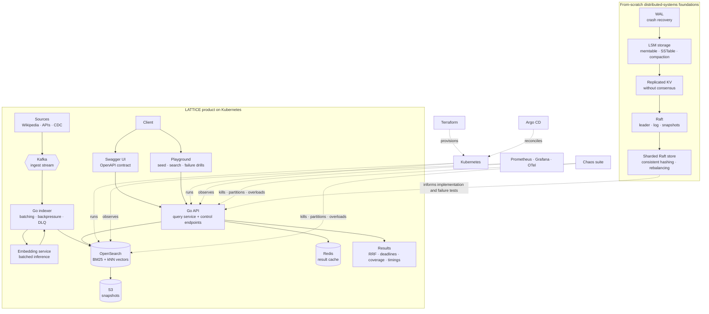

# LATTICE — Distributed Search & Retrieval Platform


**LATTICE is a distributed-systems learning project that becomes a working hybrid search platform.**

The project starts with the hard foundations—durable storage, replication, consensus, and sharding—and ends with one million documents indexed and searched on Kubernetes. It is tested through Swagger UI, an interactive playground, automated integration tests, and deliberately destructive chaos experiments.

[Architecture](#architecture) · [Build phases](#build-phases) · [Swagger and playground](#swagger-ui-and-playground) · [Walkthrough](docs/walkthrough.md) · [Project roadmap](docs/lattice.md)

---

## The engineering thesis

Search is the product surface. The real subject is what happens to data when machines fail, disagree, or disappear.

LATTICE must:

- keep acknowledged writes across crashes;
- show how replication fails before consensus is introduced;
- elect a leader and replicate safely with Raft;
- rebalance sharded data without silently losing it;
- ingest and search at least one million documents;
- return partial search results when part of the cluster is unreachable; and
- say so explicitly with `"complete": false`.

The system should never quietly turn a degraded answer into a seemingly complete one.

## Architecture

The architecture has two connected tracks. The first builds the distributed-systems foundations from scratch. The second uses those lessons to operate the LATTICE search product with Kubernetes and OpenSearch.



The custom WAL, LSM, Raft, and sharding packages are deliberately separable and readable on their own. OpenSearch remains the production search index in the final platform; the from-scratch components provide the distributed-systems implementation and reasoning that make the platform understandable rather than magical.

## End-to-end request flow

### Ingest

```text
Document producer
    → Kafka topic
    → Go indexer
    → batched embedding
    → OpenSearch _bulk request
    → per-document result inspection
    → offset commit or dead-letter queue
```

The indexer uses at-least-once delivery and deterministic document IDs. Offsets advance only after a document is indexed or placed in the DLQ. Transient rejections cause consumer backpressure; permanent failures do not block the partition.

### Query

```text
Client
    → Swagger UI, playground, or API client
    → query API
    → BM25 branch + vector branch under one deadline
    → reciprocal rank fusion
    → partial-result collection
    → results + coverage + stage timings
```

Example response shape:

```json
{
  "results": [],
  "coverage": {
    "shards_queried": 6,
    "shards_answered": 5,
    "complete": false
  },
  "timings_ms": {
    "parse": 0.4,
    "bm25": 22.1,
    "vector": 41.7,
    "fuse": 1.8
  }
}
```

Partial results inside the deadline are preferable to a late complete response, provided the client can see exactly what happened.

## Build phases

The project is built in six phases over weeks 11–26. Each phase has a working artifact, a failure experiment, and measurements that become evidence for the next phase.

| Phase | Focus | Build and prove |
|---|---|---|
| 1 · Weeks 11–14 | Durable single-node storage | WAL, memtable, SSTables, compaction, recovery, MVCC; survive repeated `kill -9` runs |
| 2 · Weeks 15–17 | Replication without consensus | Replicated KV store; demonstrate stale reads, split-brain leaders, and divergent writes |
| 3 · Weeks 18–21 | Consensus | Raft leader election, persistence, replication, commit rules, snapshots, and log compaction |
| 4 · Weeks 22–23 | Sharding | Consistent hashing, quorum reads/writes, live rebalancing, and migration-latency measurements |
| 5 · Weeks 24–25 | Search product | Kafka indexer, embeddings, OpenSearch hybrid search, Go query API, Kubernetes, Terraform, Argo CD, Swagger, and playground |
| 6 · Week 26 | Chaos and hardening | Observability, SLOs, node loss, disk pressure, partitions, certificate expiry, restore drill, security hardening, and postmortem |

The detailed curriculum and definition of done are in [`docs/lattice.md`](docs/lattice.md).

## Swagger UI and playground

The final product will be testable without writing a client application:

- **Swagger UI:** interactive OpenAPI documentation for health, document publishing, search, reindex, and operational endpoints.
- **Playground:** a guided browser workflow for loading sample documents, running keyword and semantic searches, inspecting coverage and timings, and triggering safe local failure drills.
- **CLI and curl:** every playground action will have a reproducible command for automation and CI.

The intended local surface is:

| Surface | Purpose |
|---|---|
| `/docs` | Swagger UI |
| `/openapi.yaml` | OpenAPI specification |
| `/playground` | Interactive end-to-end testing |
| `/healthz` | Liveness |
| `/readyz` | Dependency readiness |
| `/metrics` | Prometheus metrics |
| `/v1/search` | Hybrid search |
| `/v1/documents` | Playground-friendly document publishing into the ingest path |

`/v1/documents` is a convenience adapter for local testing. Production ingestion still exercises Kafka, batching, embeddings, backpressure, offsets, and the DLQ.

Follow [`docs/walkthrough.md`](docs/walkthrough.md) for the complete test journey.

## Definition of done

- A storage engine loses no acknowledged write across one hundred crash-recovery runs.
- Raft passes its full test suite one hundred consecutive times.
- Leader-election time is measured across fifty leader kills.
- One million documents are indexed and searchable with a stated p99.
- p99 is measured during an active segment merge, not only at rest.
- Unreachable shards produce partial results with explicit coverage.
- Swagger UI and the playground exercise the same API contract used by automated tests.
- Terraform and Argo CD rebuild and deploy the system without manual cluster mutation.
- Chaos behavior is documented for every injected failure.
- Snapshot restore is timed and included in the runbook and benchmark report.
- `docs/THREAT_MODEL.md`, `docs/RUNBOOK.md`, `docs/benchmarks.md`, and one postmortem are published.

## Service targets

| Property | Target |
|---|---|
| Corpus | At least 1,000,000 documents |
| Query latency | p99 below 200ms; p99 below 400ms during merge |
| Ingest freshness | p95 below 60 seconds |
| Query availability | 99.9% over 30 days |
| Durability | No silent loss: indexed or DLQ |
| Single-node recovery | Cluster green within 5 minutes |

All capacity and cost numbers remain unmeasured until the load tests run. No benchmark cell is filled with an estimate.

## Repository layout

```text
lattice/
├─ cmd/{indexer,latticectl}/       query service is `cmd/`
├─ internal/
│  ├─ ingest/  ├─ search/  ├─ server/
│  └─ providers/{opensearch,kafka}/
├─ pkg/
│  ├─ wal/       durable write-ahead log
│  ├─ lsm/       storage engine
│  └─ raft/      consensus module
├─ api/           OpenAPI specification
├─ deploy/        Compose, Kubernetes, Terraform, and Argo CD
├─ bench/         load and recovery tests
├─ chaos/         failure experiments
└─ docs/
```

## Documentation

| Document | Contents |
|---|---|
| [`docs/lattice.md`](docs/lattice.md) | Authoritative six-phase project roadmap |
| [`docs/ARCHITECTURE.md`](docs/ARCHITECTURE.md) | Runtime architecture and failure boundaries |
| [`docs/walkthrough.md`](docs/walkthrough.md) | End-to-end Swagger, playground, CLI, and chaos testing walkthrough |
| [`docs/RPD.md`](docs/RPD.md) | Product requirements and acceptance criteria |
| [`docs/ENGINEERING.md`](docs/ENGINEERING.md) | Search-platform design and operational decisions |
| [`docs/RUNBOOK.md`](docs/RUNBOOK.md) | Incident response and restore procedures |
| [`docs/THREAT_MODEL.md`](docs/THREAT_MODEL.md) | Assets, trust boundaries, threats, and controls |
| `docs/benchmarks.md` | Planned capacity, cost, and restore results |

## Current status

The local end-to-end path is runnable now: WAL/LSM/MVCC storage, replication and Raft teaching modules, sharding, hybrid search, Swagger UI, playground, snapshots, reindexing, metrics, and deterministic chaos tests are implemented. The Compose and Kubernetes manifests provide the production-shaped Kafka/OpenSearch path. One-million-document capacity numbers, real embedding-model measurements, and a production Kubernetes restore drill remain explicit Phase 6 evidence to collect rather than claims made in advance.

## License

Apache-2.0. See [LICENSE](LICENSE).
