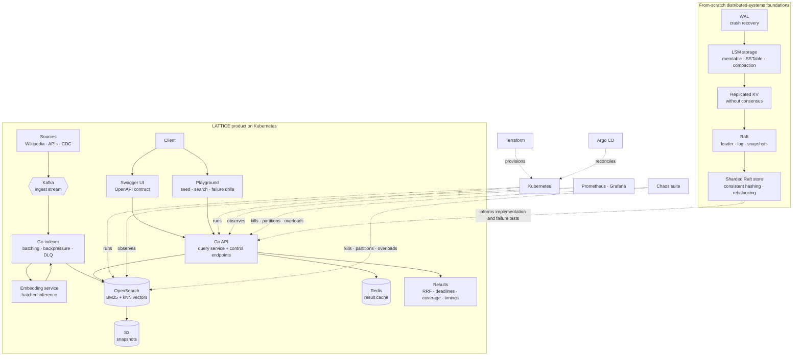

# LATTICE — Distributed Search & Retrieval Platform


**LATTICE is a distributed-systems project that grew into a working hybrid search platform. All six build phases are complete.**

The project started with the hard foundations—durable storage, replication, consensus, and sharding—and ended with 1,000,008 documents indexed and searched behind a 200ms p99 deadline. The full path is exercised through Swagger UI, an interactive playground, automated integration tests, and deliberately destructive chaos experiments.

[Architecture](#architecture) · [Build phases](#build-phases) · [Swagger and playground](#swagger-ui-and-playground) · [Definition of done](#definition-of-done) · [Walkthrough](docs/walkthrough.md) · [Status](#status)

---

## The engineering thesis

Search is the product surface. The real subject is what happens to data when machines fail, disagree, or disappear.

LATTICE had to:

- keep acknowledged writes across crashes;
- show how replication fails before consensus is introduced;
- elect a leader and replicate safely with Raft;
- rebalance sharded data without silently losing it;
- ingest and search at least one million documents;
- return partial search results when part of the cluster is unreachable; and
- say so explicitly with `"complete": false`.

Every one of those is implemented and measured. The system never quietly turns a degraded answer into a seemingly complete one — the at-rest million-document benchmark returned 93 explicitly incomplete responses under its deadline, and each one is reported as such rather than hidden.

## Architecture

The architecture has two connected tracks. The first builds the distributed-systems foundations from scratch. The second uses those lessons to operate the LATTICE search product with Kubernetes and OpenSearch.



The custom WAL, LSM, Raft, and sharding packages are deliberately separable and readable on their own. OpenSearch remains the production search index in the final platform; the from-scratch components provide the distributed-systems implementation and reasoning that make the platform understandable rather than magical.

## End-to-end request flow

### Ingest

```text
Document producer
    → Kafka topic
    → Go indexer
    → batched embedding
    → OpenSearch _bulk request
    → per-document result inspection
    → offset commit or dead-letter queue
```

The indexer uses at-least-once delivery and deterministic document IDs. Offsets advance only after a document is indexed or placed in the DLQ. Transient rejections cause consumer backpressure; permanent failures do not block the partition.

### Query

```text
Client
    → Swagger UI, playground, or API client
    → query API
    → BM25 branch + vector branch under one deadline
    → reciprocal rank fusion
    → partial-result collection
    → results + coverage + stage timings
```

Example response shape:

```json
{
  "results": [],
  "coverage": {
    "shards_queried": 6,
    "shards_answered": 5,
    "complete": false
  },
  "timings_ms": {
    "parse": 0.4,
    "bm25": 22.1,
    "vector": 41.7,
    "fuse": 1.8
  }
}
```

Partial results inside the deadline are preferable to a late complete response, provided the client can see exactly what happened.

## Build phases

The project was built in six phases over weeks 11–26. Each phase produced a working artifact, a failure experiment, and measurements that became evidence for the next phase. All six are complete.

| Phase | Focus | Built and proven | Status |
|---|---|---|---|
| 1 · Weeks 11–14 | Durable single-node storage | WAL, memtable, SSTables, compaction, recovery, MVCC; survived repeated `kill -9` runs | Complete |
| 2 · Weeks 15–17 | Replication without consensus | Replicated KV store; demonstrates stale reads, split-brain leaders, and divergent writes | Complete |
| 3 · Weeks 18–21 | Consensus | Raft leader election, persistence, replication, commit rules, snapshots, and log compaction | Complete |
| 4 · Weeks 22–23 | Sharding | Consistent hashing, quorum reads/writes, live rebalancing, and migration-latency measurements | Complete |
| 5 · Weeks 24–25 | Search product | Kafka indexer, embeddings, OpenSearch hybrid search, Go query API, Kubernetes, Terraform, Argo CD, Swagger, and playground | Complete |
| 6 · Week 26 | Chaos and hardening | Observability, SLOs, node loss, disk pressure, partitions, certificate expiry, restore drill, security hardening, and postmortem | Complete |

The detailed phase-by-phase plan and definition of done are in [`docs/lattice.md`](docs/lattice.md).

## Swagger UI and playground

The product is testable without writing a client application:

- **Swagger UI:** interactive OpenAPI documentation for health, document publishing, search, reindex, and operational endpoints.
- **Playground:** a guided browser workflow for loading sample documents, running keyword and semantic searches, inspecting coverage and timings, and triggering safe local failure drills.
- **CLI and curl:** every playground action has a reproducible command for automation and CI.

The local surface is:

| Surface | Purpose |
|---|---|
| `/docs` | Swagger UI |
| `/openapi.yaml` | OpenAPI specification |
| `/playground` | Interactive end-to-end testing |
| `/healthz` | Liveness |
| `/readyz` | Dependency readiness |
| `/metrics` | Prometheus metrics |
| `:19091/metrics` in Compose | Indexer lag, batch, retry, and DLQ metrics |
| `/v1/search` | Hybrid search |
| `/v1/documents` | Playground-friendly document publishing into the ingest path |

`/v1/documents` is a convenience adapter for local testing. Production ingestion still exercises Kafka, batching, embeddings, backpressure, offsets, and the DLQ.

Follow [`docs/walkthrough.md`](docs/walkthrough.md) for the complete test journey.
The complete route-level contract is in [`api.md`](api.md). No real secrets
are checked into the repository: Compose uses development-only inline
configuration, while Terraform creates Kubernetes Secrets from supplied
variables. See [`.env.example`](.env.example) and the walkthrough for the
configuration boundary.

For a Kubernetes deployment with API TLS and OpenSearch mTLS, render the
required-secret overlay in [`deploy/k8s-secure`](deploy/k8s-secure). The base
manifests remain suitable for a local development cluster; the secure overlay
requires certificates and explicit trust roots before it can start.

## Definition of done

Every criterion below is met, and each is stated with the evidence behind it rather than asserted on its own.

- [x] **A storage engine loses no acknowledged write across one hundred crash-recovery runs** — 100/100 subprocess `SIGKILL` recoveries passed (`make wal-crash-evidence`).
- [x] **Raft passes its full test suite one hundred consecutive times** — 100/100 passed.
- [x] **Leader-election time is measured across fifty leader kills** — 50 trials, 3 logical election ticks each ([`docs/election-distribution.csv`](docs/election-distribution.csv)).
- [x] **One million documents are indexed and searchable with a stated p99** — 1,000,008 documents; 16.66ms p50, 191.85ms p99 at 1,514 QPS.
- [x] **p99 is measured during an active segment merge, not only at rest** — 24.69ms p50 / 95.55ms p99 during concurrent indexing; 49.06ms p99 during an explicit force-merge (59 → 3 primary segments).
- [x] **Unreachable shards produce partial results with explicit coverage** — `coverage.complete: false` under deadline pressure, exercised by the chaos suite and the network-partition experiment.
- [x] **Swagger UI and the playground exercise the same API contract used by automated tests** — one OpenAPI spec in [`api/`](api), one contract in [`api.md`](api.md).
- [x] **Terraform and Argo CD rebuild and deploy the system without manual cluster mutation** — `make smoke-argocd` reconciles the worktree through Argo CD in a disposable kind cluster; a fresh Terraform/operator kind deployment passed publish → Kafka/indexer → hybrid search.
- [x] **Chaos behavior is documented for every injected failure** — [`chaos/`](chaos/README.md).
- [x] **Snapshot restore is timed and included in the runbook and benchmark report** — 25.016s for 1,000,008 documents, restored count verified.
- [x] **`docs/THREAT_MODEL.md`, `docs/RUNBOOK.md`, `docs/benchmarks.md`, and one postmortem are published** — see [Documentation](#documentation).

## Service targets

| Property | Target | Measured |
|---|---|---|
| Corpus | At least 1,000,000 documents | 1,000,008 searchable documents |
| Query latency | p99 below 200ms; p99 below 400ms during merge | 191.85ms at rest; 49.06ms during force-merge |
| Ingest freshness | p95 below 60 seconds | Not measured |
| Query availability | 99.9% over 30 days | Not measured — no 30-day production window exists |
| Durability | No silent loss: indexed or DLQ | Verified in the Compose acceptance flow |
| Single-node recovery | Cluster green within 5 minutes | Not measured |

Cost per million documents and per million queries remain unmeasured, and are stated as unmeasured rather than estimated. No benchmark cell in this repository is filled with an estimate; the full log is in [`docs/benchmarks.md`](docs/benchmarks.md).

## Repository layout

```text
lattice/
├─ cmd/{indexer,latticectl,latticebench}/       query service is `cmd/`
├─ internal/
│  ├─ ingest/  ├─ search/  ├─ server/
│  └─ providers/{opensearch,kafka}/
├─ pkg/
│  ├─ wal/       durable write-ahead log
│  ├─ lsm/       storage engine
│  └─ raft/      consensus module
├─ api/           OpenAPI specification
├─ deploy/        Compose, Kubernetes, Terraform, and Argo CD
├─ bench/         load and recovery tests
├─ chaos/         failure experiments
└─ docs/
```

## Documentation

| Document | Contents |
|---|---|
| [`docs/lattice.md`](docs/lattice.md) | Authoritative six-phase build plan and definition of done |
| [`docs/ARCHITECTURE.md`](docs/ARCHITECTURE.md) | Runtime architecture and failure boundaries |
| [`docs/walkthrough.md`](docs/walkthrough.md) | End-to-end Swagger, playground, CLI, and chaos testing walkthrough |
| [`api.md`](api.md) | Complete HTTP API reference and request/response examples |
| [`docs/RPD.md`](docs/RPD.md) | Product requirements and acceptance criteria |
| [`docs/ENGINEERING.md`](docs/ENGINEERING.md) | Search-platform design and operational decisions |
| [`docs/RUNBOOK.md`](docs/RUNBOOK.md) | Incident response and restore procedures |
| [`docs/THREAT_MODEL.md`](docs/THREAT_MODEL.md) | Assets, trust boundaries, threats, and controls |
| [`docs/benchmarks.md`](docs/benchmarks.md) | Measured evidence and remaining capacity, cost, and restore work |
| [`docs/postmortem-compose-integration.md`](docs/postmortem-compose-integration.md) | Published Compose integration postmortem |

## Status

**Complete.** All six phases shipped and every criterion in the [definition of done](#definition-of-done) is met.

The end-to-end path is runnable today: WAL/LSM/MVCC storage, replication and Raft modules, sharding, hybrid search, Swagger UI, playground, snapshots, reindexing, metrics, and deterministic chaos tests. The production-shaped Compose path was measured with 1,000,008 searchable documents, full-corpus query percentiles, a concurrent-indexing merge window, an explicit force-merge window, and a timed native restore. A fresh Terraform/operator-backed kind deployment passed publish → Kafka/indexer → hybrid search, and `make smoke-argocd` reconciles the worktree through Argo CD in a disposable cluster. The raw reports live beside [`docs/benchmarks.md`](docs/benchmarks.md).

What the project deliberately does **not** claim: measurements from a real embedding model, a restore drill against a production-scale scratch cluster, a 30-day availability window, and cost-per-million figures. Those need infrastructure this project does not run, and they are recorded as unmeasured rather than estimated.

The scope is closed. Issues and questions are welcome; new phases are not planned.

## License

Apache-2.0. See [LICENSE](LICENSE).
