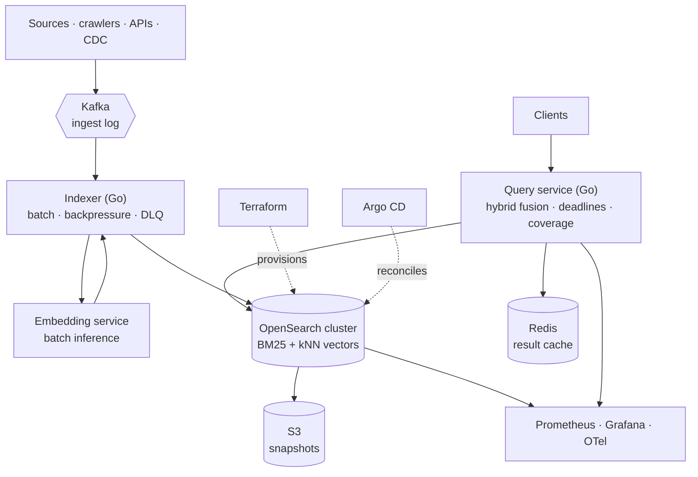

# LATTICE — Distributed Search & Retrieval Platform


**Hybrid search over millions of documents, operated to an SLO.**

*OpenSearch on Kubernetes. Kafka ingest with backpressure. BM25 and vector retrieval fused. Terraform-provisioned, Argo-reconciled, chaos-tested — with the capacity and cost numbers published.*

[Architecture](#architecture) • [RPD](docs/RPD.md) • [Engineering Design](docs/ENGINEERING.md) • [Benchmarks](docs/benchmarks.md) • [Runbook](docs/RUNBOOK.md)

---

## Project Status

> **Design published, implementation starting.** Nothing claimed as shipped unless the table says so. Benchmark cells reading `—` are unmeasured and will not be filled with estimates.

| Component | State |
|---|---|
| RPD, engineering design | Written |
| Terraform cluster + OpenSearch operator | Not started |
| Ingest pipeline (Kafka → indexer) | Not started |
| Hybrid retrieval (BM25 + kNN) | Not started |
| Query service with deadlines and coverage | Not started |
| ISM lifecycle, snapshots, restore drill | Not started |
| Observability + chaos suite | Not started |
| Capacity and cost report | Not started |

---

## What is LATTICE?

Running a search engine is a `helm install`. **Operating one is not.** The gap between those two is where this project lives.

A search cluster at scale forces a sequence of decisions that have no default answer: how many shards, sized how, on what hardware; what happens to query latency during a merge; how the index is rebuilt without downtime; what a query returns when a data node is unreachable; how much it costs per million documents; and whether the snapshot you have been taking for six months actually restores.

LATTICE is that operational surface, built deliberately and measured.

**Four questions it answers concretely:**

1. **What does search return when a shard is down?** Not a 500. Ranked results from the shards that answered, inside the deadline, with the coverage gap declared in the response body. A search API that cannot tell you it gave a partial answer is one you cannot debug.
2. **Why is p99 slow right now?** Query latency is decomposed by phase — parse, fan-out, shard execution, gather, rerank — because "search is slow" is not actionable and "gather p99 doubled after the shard count changed" is.
3. **What does it cost?** Cost per million documents indexed and per million queries served, from measured resource consumption.
4. **Does the backup work?** Restore is rehearsed on a schedule and timed, not assumed.

### What this builds, and what it buys

**Builds:** the ingest pipeline (Kafka consumer, bulk indexing with backpressure, dead-letter handling), the query service (hybrid fusion, per-stage deadlines, coverage reporting), and the operational apparatus — SLOs, chaos suite, capacity model, runbook.

**Buys:** OpenSearch for the inverted index, BM25, and kNN. Kafka for the ingest log. Kubernetes and the OpenSearch operator for orchestration. Terraform for provisioning. Argo CD for delivery. Prometheus and Grafana for observation.

> **A note on the earlier design.** An earlier version of LATTICE built the LSM storage engine, the consistent-hash ring, the replication protocol, and a MapReduce engine from scratch. That is a legitimate way to learn distributed systems, and [MERIDIAN](https://github.com/nickemma/meridian) — Raft written from scratch, Rust LSM storage — already carries that signal in this portfolio. Repeating it here would prove the same thing twice while leaving the operational skills unproven. **This version proves the other half.**

---

## Architecture



---

## The Query Path

```
GET /v1/search?q=distributed+consensus&deadline=150ms
   ↓
Parse            query analysis · filters · pagination bounds
   ↓
Plan             BM25 branch + vector branch, both bounded by the deadline
   ↓
   ├──→ OpenSearch BM25   (keyword relevance)
   └──→ OpenSearch kNN    (semantic neighbours)
   ↓
Fuse             reciprocal rank fusion
   ↓
Gather           whatever returned inside the deadline
   ↓
Respond          results + coverage + per-stage timings
```

```json
{
  "results": [ ... ],
  "coverage": { "shards_queried": 6, "shards_answered": 5, "complete": false },
  "timings_ms": { "parse": 0.4, "bm25": 22.1, "vector": 41.7, "fuse": 1.8 }
}
```

`"complete": false` is a feature, carried over from the earlier design because it was the right idea. Partial results inside the deadline beat complete results after it — and the client is told which it received.

---

## Capacity and Cost — the deliverable

**All cells unmeasured until the load test runs.**

| Measurement | Target | Measured |
|---|---|---|
| Corpus size indexed | ≥ 1,000,000 docs | — |
| Query latency, p50 / p99 | < 50ms / < 200ms | — |
| Sustained query throughput (QPS) | — | — |
| Sustained indexing throughput (docs/sec) | — | — |
| Query p99 during active merge | < 400ms | — |
| Time to restore full index from snapshot | — | — |
| Recovery time after data-node loss | < 5 min | — |
| Cost per million documents indexed | — | — |
| Cost per million queries served | — | — |

The two rows that separate this from a tutorial: **p99 during merge** (segment merges are the classic hidden latency source, and almost nobody publishes it for their own workload) and **time to restore** (the number every backup strategy claims and few have measured).

---

## Service Level Objectives

| SLI | Definition | SLO |
|---|---|---|
| Query availability | Non-5xx query responses ÷ total | 99.9% / 30d |
| Query latency | p99 end to end | < 200ms |
| Result completeness | Queries answered with full shard coverage | 99% |
| Ingest freshness | Document published → queryable, p95 | < 60s |
| Ingest durability | Documents accepted that reach the index | 100% (DLQ counts as reaching it) |

Ingest durability is 100% by definition of the dead-letter queue: a document either indexes or lands in the DLQ with its error. Silent loss is the failure this SLO exists to prevent.

---

## Metrics

| Metric | Type | Labels | Question it answers |
|---|---|---|---|
| `lattice_query_duration_seconds` | histogram | stage, query_type | Which stage owns the tail? |
| `lattice_query_coverage_ratio` | histogram | — | How often are we serving partial results? |
| `lattice_query_cache_hits_total` | counter | — | Is the result cache earning its keep? |
| `lattice_ingest_lag_seconds` | gauge | topic, partition | How stale is the index? |
| `lattice_ingest_batch_size` | histogram | — | Are we bulk-indexing efficiently? |
| `lattice_ingest_dlq_total` | counter | reason | What is failing to index, and why? |
| `lattice_embedding_duration_seconds` | histogram | — | Is embedding the ingest bottleneck? |
| `opensearch_merge_duration_seconds` | histogram | index | Is a merge the reason queries got slow? |
| `opensearch_shard_docs` | gauge | index, shard | Is sharding balanced or lopsided? |
| `opensearch_jvm_heap_used_ratio` | gauge | node | Are we heading for a GC pause? |
| `opensearch_circuit_breaker_trips_total` | counter | breaker | Are queries being rejected for memory? |
| `lattice_snapshot_age_seconds` | gauge | repository | When did we last actually back up? |

`opensearch_jvm_heap_used_ratio` and the circuit breaker counter are the two that lead an incident. Heap pressure produces GC pauses that look like network problems, and a tripped breaker rejects queries before latency alerts fire.

---

## Failure Modes

| Failure | Blast radius | Detection | Mitigation |
|---|---|---|---|
| Data node lost | Shards it held primary for | Cluster health yellow | Replicas promoted; queries continue with coverage reported; node replaced |
| Two nodes lost, replica count 1 | Some shards unavailable | Cluster health red | Partial results with `complete: false`; restore path in runbook |
| Segment merge storm | Query latency cluster-wide | Merge duration + p99 | Throttled merge policy; refresh interval tuned for ingest bursts |
| JVM heap pressure | Node-level GC pauses | Heap ratio | Circuit breakers reject expensive queries before OOM; bounded aggregations |
| Hot shard (skewed terms) | One shard's latency | Per-shard QPS skew | Routing review; shard count revisited; stopword handling |
| Kafka consumer lag | Index freshness | Ingest lag gauge | Scale indexer replicas; backpressure prevents overwhelming the cluster |
| Poison document | Blocks a partition | DLQ counter | Dead-letter after bounded retries; partition proceeds |
| Embedding service down | Vector branch only | Embedding errors | Ingest continues keyword-only, flagged for backfill; queries degrade to BM25 |
| Snapshot repository unreachable | Backups only | Snapshot age gauge | Alert on age, not on failure — a snapshot that silently stopped is the dangerous case |
| Unbounded query (deep pagination) | Cluster memory | Query cost guard | `from`/`size` capped; `search_after` required past a threshold |

---

## Tech Stack

| Layer | Technology | Why |
|---|---|---|
| **Search + vectors** | OpenSearch | Inverted index, BM25, and kNN in one cluster — no separate vector database to keep consistent |
| **Cluster orchestration** | OpenSearch Kubernetes Operator | Rolling upgrades, scaling, and config as CRDs |
| **Ingest log** | Kafka (or Redpanda) | Replayable, partitioned, gives backpressure and reprocessing for free |
| **Indexer + query service** | Go | Bulk indexing with bounded concurrency; low-overhead query fan-out |
| **Embeddings** | Sentence-transformers, batched | Runs on CPU at this corpus size; GPU optional |
| **Result cache** | Redis | Repeated queries are the cheapest latency win available |
| **Snapshots** | S3 repository | Restore drilled on a schedule, timed and published |
| **Provisioning** | Terraform | Cluster, node pools, storage classes, IAM as code |
| **Delivery** | Argo CD | Index templates, ISM policies, and app config reconciled from git |
| **Observability** | Prometheus · Grafana · OpenTelemetry | Per-stage query latency; cluster internals from the OpenSearch exporter |

---

## Non-Goals

- **Not a search engine implementation.** OpenSearch is better than anything written here would be. [MERIDIAN](https://github.com/nickemma/meridian) carries the from-scratch storage signal in this portfolio.
- **Not a web-scale crawler.** Ingest sources are bounded and stated.
- **Not a RAG framework.** LATTICE retrieves; [TESSERA](https://github.com/nickemma/tessera) serves the model that consumes the retrieval.
- **Not multi-region.** One region until an SLO breach says otherwise.
- **Not a managed-service replacement in general.** Where Elastic Cloud or OpenSearch Serverless wins, the benchmark report says so.

---

## Documentation

| Document | Contents |
|---|---|
| [`docs/RPD.md`](docs/RPD.md) | Requirements, acceptance criteria, build order |
| [`docs/ENGINEERING.md`](docs/ENGINEERING.md) | Design, sharding model, build-vs-buy decisions |
| [`docs/benchmarks.md`](docs/benchmarks.md) | Method, capacity curves, cost, and where this loses |
| [`docs/RUNBOOK.md`](docs/RUNBOOK.md) | "Search is slow", cluster red, restore procedure |
| [`docs/adr/`](docs/adr) | Decisions and the alternatives that lost |

---

## Author

**[@nickemma](https://github.com/nickemma)** — Building production-grade distributed systems, infrastructure, and platform engineering from first principles.

💼 Open to distributed systems, infrastructure, platform, and backend engineering roles at companies building serious systems.

<div align="center">
<a href="https://www.linkedin.com/in/techieemma/"></a>
<a href="https://twitter.com/techieemma"></a>
<a href="https://github.com/nickemma/"></a>
<a href="https://techieemma.medium.com/"></a>
<a href="mailto:nicholasemmanuel321@gmail.com"></a>
</div>

---

<div align="center">

**Building Systems, Building Faith — One Commit at a Time**

*Part of [The Nicholas Emmanuel Engineering Blueprint](https://github.com/nickemma/Nicholas-Engineering-Blueprint).*
