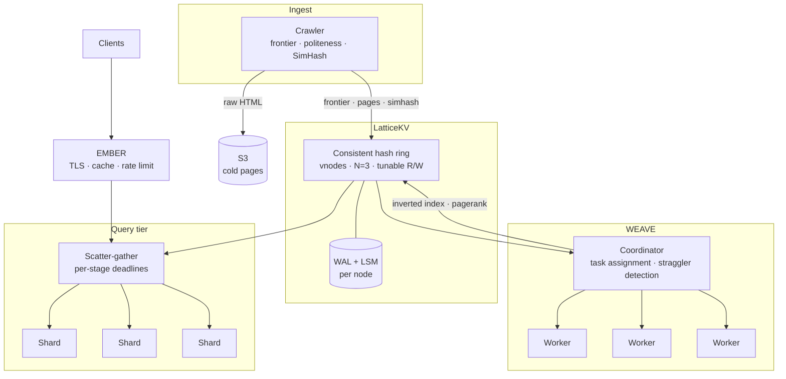

# LATTICE — Distributed Search Engine

<div align="center">


[](https://github.com/nickemma/lattice/actions)

**A search engine over a million pages, on a storage and compute stack written from scratch.**

_Own key-value store. Own MapReduce. Own crawler, index, and ranking. No managed data services. The distributed-systems vocabulary is only yours once you've written the thing that fails._

[Architecture](#architecture) • [Decisions](docs/decisions/) • [Benchmarks](docs/benchmarks.md) • [Threat model](docs/threat-model.md) • [Runbook](docs/runbook.md) • [Roadmap](#roadmap)

</div>

---

## Project Status

> **Nothing is built. This repository contains a design derived from a frozen charter and nothing else.**
> If you clone this expecting a search engine, you will be disappointed — for now. The design target is in [the charter](https://github.com/nickemma/Nicholas-Engineering-Blueprint/blob/main/docs/part-6-flagships/lattice.md), written before the first commit and never edited to match what shipped. Divergence is recorded at level exit, not smoothed over.

| Behavior | State |
|---|---|
| B1 · Durably stores a key; survives `kill -9` mid-write | Not started |
| B2 · LSM with compaction; reads don't degrade with size | Not started |
| B3 · RPC with deadlines, retries, backpressure | Not started |
| B4 · Three nodes, one keyspace; one dies, reads succeed | Not started |
| B5 · MERIDIAN re-examined against the Raft paper | Not started |
| B6 · Linearizability checker passes the store, or says why not | Not started |
| B7 · Wordcount over 10 GB, worker killed, answer still right | Not started |
| B8 · Crawler fetches 100k+ pages politely | Not started |
| B9 · Ranked results from own index, p99 < 200 ms | Not started |
| B10 · Chaos suite partitions the cluster; numbers hold | Not started |

**One repository, not six.** LATTICE ships as one system, is benchmarked as one system, and fails as one system. The component split lives in `cmd/` and `internal/modules/`, not in six GitHub repos that would multiply the documentation cost while hiding the only genuinely interesting fact — that one person built the whole stack.

---

## What is LATTICE?

Search is the canonical distributed-systems problem, and it is canonical because every hard part shows up at once. You have to fetch the web without being hated for it. You have to store more than fits on a machine. You have to compute over all of it in a way that survives machines dying mid-computation. And then you have to answer in under two hundred milliseconds, from an index sharded across nodes that are individually unreliable.

Every one of those has a managed service. LATTICE uses none of them. S3 holds raw pages because cold object storage is not the lesson; everything else — the key-value store, the replication, the compute engine, the queue, the index — is written here.

The first bet is **availability over consistency, chosen rather than defaulted into.** LatticeKV is Dynamo-shaped: consistent hashing with virtual nodes, tunable R/W quorums, hinted handoff, anti-entropy, read repair. That is the right stance for a search corpus, where a slightly stale posting list costs a marginally worse ranking and nothing else. It is the *wrong* stance for a secrets manager, which is why [MERIDIAN](https://github.com/nickemma/meridian) — same portfolio, same author — makes the opposite call and puts consensus on the critical path. Having both, and being able to say precisely when each is correct, is more of the point than either alone.

The second bet is that **the tail is the product.** A query scatters to every term shard and gathers. Scatter-gather means the slowest shard sets your latency, and with enough shards something is always slow — so waiting for everyone is not a strategy, it is a guarantee of a bad p99. The query tier runs on a deadline: partial results ship when the clock runs out, with the gap declared in the response rather than hidden.

The third bet is that **a distributed job must be deterministically re-executable.** A worker dying halfway through PageRank must not corrupt the result. Tasks are pure functions of their inputs, outputs are durable before they are acknowledged, and a re-run produces the same answer — so killing a worker is a scheduling event rather than an incident.

**The real question this system answers:** what does your search return when one index shard is down? Most toy search engines return a 500. LATTICE returns ranked results from the shards that answered, within the deadline, with the coverage gap stated in the response body.

---

## What Each Layer Proves

| Layer | What It Demonstrates |
|---|---|
| WAL + LSM written from scratch | Storage internals — durability, fsync discipline, compaction, read amplification |
| Crash recovery under `kill -9` | You know the difference between "written" and "durable" |
| Consistent hashing with virtual nodes | Partitioning and rebalancing as arithmetic you can property-test |
| Tunable R/W quorums + hinted handoff | The Dynamo playbook, and when availability is the correct choice |
| Linearizability checking | You verify consistency claims instead of asserting them |
| Raft re-examination (MERIDIAN) | You can read your own year-old code against the paper and find the bug |
| MapReduce with deterministic re-execution | Distributed compute correctness under partial failure |
| Straggler detection + speculative execution | The tail at scale, applied rather than cited |
| Polite crawler at 1M pages | Backpressure across stages, and engineering with external consequences |
| Term-sharded index + PageRank | Information retrieval on infrastructure you wrote |
| Deadline-bounded scatter-gather | p99 as a design constraint, not a measurement taken afterward |
| Chaos suite gating the demo | Correctness under adversarial conditions, not happy paths |

---

## Architecture

> **Design target.** Nothing below exists yet.



EMBER fronts the query tier — the edge gateway from the first flagship is not a separate exercise, it is this system's front door.

---

## The Query Path

```
GET /v1/search?q=distributed+consensus
   ↓
EMBER            TLS · cache lookup · per-tenant rate limit
   ↓
Query tier       parse · term lookup · shard fan-out plan
   ↓
   ├──→ shard 0  posting list intersect  ─┐
   ├──→ shard 1  posting list intersect   │  deadline: 120 ms
   └──→ shard 2  posting list intersect  ─┘
   ↓
Gather           whatever arrived by the deadline
   ↓
Rank             TF-IDF × PageRank
   ↓
Respond          results + per-stage timings + coverage
```

```json
{
  "results": [ ... ],
  "coverage": { "shards_queried": 3, "shards_answered": 2, "complete": false },
  "timings_ms": { "parse": 0.4, "fanout": 1.1, "gather": 118.0, "rank": 3.2 }
}
```

`"complete": false` is a feature. A search engine that cannot tell you it gave you a partial answer is a search engine you cannot debug.

---

## The Four Pillars

### 1. LatticeKV — `internal/modules/kv/`

The storage foundation, Dynamo-shaped by choice.

- **WAL + LSM** — write-ahead log with fsync discipline, memtable, SSTable compaction, bloom filters
- **Crash recovery** — `kill -9` mid-write is a tested path, not a hope
- **Consistent hashing with virtual nodes** — rebalancing on membership change is arithmetic, property-tested without a network
- **Tunable R/W per request** — N=3 with R and W chosen by the caller, because different tables in this system need different guarantees
- **Hinted handoff + read repair + anti-entropy** — a node returning after a partition converges rather than being reconciled by hand

### 2. WEAVE — `internal/modules/weave/`

Distributed compute, built for machines that die.

- **Coordinator + workers** — task assignment, heartbeats, reassignment on loss
- **Deterministic re-execution** — a task is a pure function of its inputs; re-running is always safe
- **Shuffle** — partitioned intermediate output, durable before acknowledged
- **Straggler handling** — duration outliers trigger speculative re-execution; first result wins
- **Jobs**: wordcount (the correctness harness), inverted index build, PageRank iteration

### 3. Ingest & Index — `internal/modules/{crawler,index,rank}/`

- **Frontier** in LatticeKV with per-host budgets and depth caps — crawler traps are a design input, not a surprise
- **Politeness** — `robots.txt`, per-host delay, and a hard cap. Being rude to a host is a real-world consequence, which is why that state runs at full quorum
- **SimHash dedup** — near-duplicate detection before storage, not after
- **Backpressure across stages** — fetch cannot outrun store, store cannot outrun index
- **Term-sharded inverted index** — chosen over document sharding for query latency, at the cost of harder rebalancing
- **PageRank** as iterated matrix-vector multiplication over WEAVE

### 4. Serving & Verification — `internal/modules/query/`, `internal/chaos/`

- **Scatter-gather with per-stage deadlines** — partial results over late results, always
- **Coverage in the response** — the client is told what it did not get
- **Per-stage latency breakdown** in every response, because "search is slow" is not actionable
- **Linearizability checker** — operation histories verified against a model, not assumed correct
- **Chaos harness** — shard kill, ring partition, worker death mid-PageRank, all run during the demo rather than before it

---

## Tech Stack

| Layer | Technology | Why |
|---|---|---|
| **Everything** | Go 1.25 | Goroutine-per-peer replication, one static binary per role, and the primary language of this portfolio |
| **Storage engine** | Go (LSM, hand-written) | Deliberately *not* Rust here. [MERIDIAN](https://github.com/nickemma/meridian) already has a Rust LSM; writing this one in Go makes the two comparable and turns a language preference into a measurement |
| **Cold page storage** | S3 | Object storage is not the lesson. Everything above it is |
| **Inter-node RPC** | gRPC + Protobuf | Typed, streaming for log and shuffle transfer, deadline propagation for free |
| **Verification** | Go property tests + a linearizability checker | Consistency claims that are checked rather than asserted |
| **Chaos** | Docker + iptables | Controlled partitions, reproducible, in CI |
| **Observability** | Prometheus + Grafana + OpenTelemetry | Per-stage latency and replication lag are the two numbers that matter |

---

## Targets

Seeded from charter point 4, scored at level exit. Mirrored in the blueprint's `calibration.md`.

| SLI | Definition | Target | Measured |
|---|---|---|---|
| **Query latency** | End to end, p99, over ≥1M pages | < 200 ms | — |
| **Index build scaling** | Wall-clock speedup, 3 → 9 workers | near-linear | — |
| **Corpus size** | Pages crawled, deduped, indexed | ≥ 1,000,000 | — |
| **Availability under node loss** | Queries answered within deadline with one shard down | 100% | — |
| **Job correctness under worker loss** | Wordcount result with a worker killed mid-job | bit-identical | — |
| **Crawl politeness** | Requests exceeding a host's configured rate | 0 | — |
| **Whole-run cost** | USD, crawl through first queryable index | measured and published | — |

---

## Metrics

| Metric | Type | Labels | Question it answers |
|---|---|---|---|
| `lattice_query_duration_seconds` | histogram | stage | Which stage owns the tail? |
| `lattice_query_coverage_ratio` | histogram | — | How often are we serving partial results? |
| `lattice_kv_operation_duration_seconds` | histogram | op, consistency | Is quorum costing what I think it costs? |
| `lattice_kv_replica_lag_seconds` | gauge | node | Which replica is behind, and by how much? |
| `lattice_kv_hinted_handoffs_pending` | gauge | node | Is a node still catching up after a partition? |
| `lattice_kv_read_repairs_total` | counter | — | How much divergence is actually happening? |
| `lattice_compaction_duration_seconds` | histogram | level | Is compaction the reason reads got slow? |
| `lattice_weave_task_duration_seconds` | histogram | job, phase | Where are the stragglers? |
| `lattice_weave_speculative_launches_total` | counter | job | How often is the tail costing us compute? |
| `lattice_crawler_fetches_total` | counter | host_class, result | Are we crawling or being blocked? |
| `lattice_crawler_frontier_size` | gauge | — | Is a trap growing the frontier without bound? |
| `lattice_index_shard_docs` | gauge | shard | Is the term sharding balanced or lopsided? |

---

## Consistency Stance

| Data | Store | Consistency | Why |
|---|---|---|---|
| Crawl frontier | LatticeKV | R=W=2, N=3 | Duplicate fetches are wasteful, not wrong |
| Fetched pages | S3 + KV pointer | Read-your-writes | Immutable once written |
| Inverted index | LatticeKV | R=1, read-repaired | Stale posting = marginally worse ranking |
| PageRank scores | LatticeKV | R=1 | Regenerated every full rebuild |
| Host politeness state | LatticeKV | **R=W=N** | Being rude to a host is an external, social consequence |

The last row is the interesting one: one table in the same store runs at full quorum because its failure mode is outside the system. Uniform consistency across a system is usually a sign nobody chose.

---

## Failure Mode Analysis

| Failure | Blast radius | Detection | Mitigation |
|---|---|---|---|
| KV node dies | Keys where it held a replica | Failure detector | Sloppy quorum + hinted handoff; replay on return |
| Ring partition | Divergent writes | Quorum failure rate | Reads succeed at R=1; anti-entropy reconciles on heal |
| Worker dies mid-PageRank | One task | Coordinator heartbeat | Deterministic re-execution; task output idempotent |
| Straggler that never dies | The whole job's tail | Task duration outlier | Speculative re-execution; first result wins |
| Index shard unreachable | Coverage of that term range | Gather deadline expiry | Partial results, `complete: false`, coverage in body |
| Crawler trap | Frontier growth | Frontier size per host | Per-host budget + depth cap + SimHash dedup |
| Compaction interrupted | One node's read latency | LSM level-count alert | WAL replay; compaction resumes from last durable level |
| Clock skew across nodes | Ordering assumptions | NTP drift metric | Lamport and vector clocks — wall time is never load-bearing |
| Hot term (`the`) | One shard | Per-shard QPS skew | Stopword handling + posting list caching in EMBER |

---

## Security as First Principles

- **The crawler is the biggest liability** — an impolite crawler is a real-world harm, so per-host rate state is the one table in this system that runs at full quorum
- **`robots.txt` respected, and cached with a TTL** — not fetched once and remembered forever
- **Crawl budget per host and depth cap** — a trap costs bounded resources, always
- **Query input validated and bounded** — term count, wildcard expansion, and result size all capped before fan-out
- **Scatter-gather resource caps** — a single query cannot fan out to unbounded shards or hold unbounded memory in gather
- **EMBER fronts the query tier** — TLS and rate limiting are not reimplemented here, they are consumed
- **mTLS between nodes** — no plaintext inter-node traffic; node identity verified before any message is processed
- **No PII target** — the corpus is public web content, which is why this system's threat model is short and honest about it

---

## Intended Interface

> **Not implemented.** The contract, written before the code so the design is decided rather than discovered.

```bash
# Cluster
latticectl cluster status
latticectl ring show --replicas 3

# Storage, with consistency as a per-request choice
latticectl kv put --key pages/example.com --value @page.html --w 2
latticectl kv get --key pages/example.com --r 1

# Crawl
latticectl crawl start --seeds seeds.txt --max-pages 1000000 --politeness-delay 1s
latticectl crawl status

# Compute
latticectl job submit --type index --input pages/ --output index/
latticectl job submit --type pagerank --iterations 3
latticectl job status --id job_01HQ8

# Query
latticectl search --q "distributed consensus" --limit 10 --deadline 150ms

# Chaos (destructive, isolated network)
latticectl chaos partition --nodes 1,2 --duration 30s
latticectl chaos kill --node 3
```

```protobuf
service QueryService {
  rpc Search(SearchRequest) returns (SearchResponse);
}

message SearchRequest {
  string q          = 1;
  int32  limit      = 2;
  int64  deadline_ms = 3;   // partial results returned at expiry, never late results
}

message SearchResponse {
  repeated Result results  = 1;
  Coverage        coverage = 2;   // shards_queried, shards_answered, complete
  StageTimings    timings  = 3;   // parse, fanout, gather, rank
}
```

```bash
LATTICE_NODE_ID=1
LATTICE_PEERS=node2:9090,node3:9090
LATTICE_DATA_DIR=/var/lib/lattice
LATTICE_REPLICATION_FACTOR=3
LATTICE_VNODES_PER_NODE=128
LATTICE_DEFAULT_R=1
LATTICE_DEFAULT_W=2
LATTICE_MEMTABLE_MAX_BYTES=67108864
LATTICE_COMPACTION_WORKERS=2
LATTICE_HINTED_HANDOFF_TTL=24h
LATTICE_CRAWL_POLITENESS_DELAY=1s
LATTICE_CRAWL_MAX_DEPTH=6
LATTICE_CRAWL_PER_HOST_BUDGET=5000
LATTICE_QUERY_DEADLINE_MS=150
LATTICE_S3_BUCKET=lattice-pages
```

---

## Layout

<!-- charter:12 - file structure -->

Modular monolith, ports and adapters. Every dependency crossing a module boundary is an interface from that module's `ports` package.

```
lattice/
├── cmd/
│   ├── lattice-kv/          storage node
│   ├── lattice-weave/       compute coordinator + worker (one binary, two roles)
│   ├── lattice-crawler/
│   ├── lattice-query/       the serving tier
│   └── latticectl/          CLI
│
├── api/proto/lattice/v1/    kv · weave · crawler · query
│
├── internal/
│   ├── app/                 composition root — one builder per binary
│   ├── platform/            config · telemetry · id · clock · hashing · rpc · errors
│   │                        (clock is injectable: leases and timeouts need it testable)
│   ├── modules/
│   │   ├── kv/              domain: ring · vnode · quorum · hinted handoff · repair
│   │   │                    adapters/lsm: WAL · SSTable · bloom · compaction
│   │   ├── weave/           domain: job · task · shuffle · straggler · determinism
│   │   ├── crawler/         domain: frontier · robots · politeness · simhash
│   │   ├── index/           domain: posting list · term shard · tf-idf
│   │   ├── rank/            domain: pagerank iteration · convergence
│   │   └── query/           domain: fan-out plan · deadline · partial result · coverage
│   └── chaos/               the harness — a test tool, not a module
│
├── bench/                   harnesses + results/*.json
└── deploy/
```

`internal/modules/kv/domain` imports nothing outward — no `pgx`, no proto tags, no `net`. The ring is arithmetic and the quorum is arithmetic, and both are property-testable without a network.

---

## Roadmap

**V1 — Store it.** WAL · LSM · crash recovery · single-node KV

**V2 — Distribute it.** Consistent hashing · N=3 replication · tunable quorums · hinted handoff · read repair · linearizability checking

**V3 — Compute over it.** WEAVE coordinator and workers · shuffle · deterministic re-execution · straggler speculation · wordcount over 10 GB

**V4 — Fill it.** Polite crawler · frontier in LatticeKV · SimHash dedup · 1M pages to S3

**V5 — Search it.** Term-sharded inverted index · PageRank · deadline-bounded scatter-gather · p99 under 200 ms behind EMBER

**V6 — Prove it.** Chaos suite green during the demo · cost published · scaling curve published

**Deferred, with reasons in [LATER.md](LATER.md):** semantic ranking · incremental crawl · query autocomplete · multi-region · tiered storage · non-English corpora

---

## Non-Goals

- **Not a web-scale crawler.** One million pages, one region, English. The cut line is in the charter and is not negotiable mid-module.
- **Not semantic search.** TF-IDF and PageRank. Embeddings are deferred with the reason stated.
- **Not a general-purpose database.** LatticeKV is shaped for this corpus. Its consistency stance would be malpractice under a payments workload — see [MERIDIAN](https://github.com/nickemma/meridian) for the other choice.
- **Not incremental.** The index is rebuilt, not updated.
- **Not competing with Elasticsearch.** The point is having written the layer underneath one.

---

## Documentation

| Document | Contents |
|---|---|
| [`docs/architecture.md`](docs/architecture.md) | Containers, components, query path, trust boundaries, invariants |
| [`docs/decisions/`](docs/decisions/) | ADRs — every choice and the alternatives that lost |
| [`docs/threat-model.md`](docs/threat-model.md) | Crawl abuse, query-path exhaustion, controls mapped to tests |
| [`docs/benchmarks.md`](docs/benchmarks.md) | Methodology, scaling curves, cost, and where this loses |
| [`docs/runbook.md`](docs/runbook.md) | Signals, symptom → cause → action, ring operations |
| [`docs/testing.md`](docs/testing.md) | Layers, linearizability checking, chaos methodology |
| [`LATER.md`](LATER.md) | Scope cut, with reasons |

---

## One Platform, Six Repositories

These are not six projects. **EMBER** fronts everything · **LATTICE** proves the distributed core · **MERIDIAN** provides secrets, policy, lease and audit · **VEYRONIX** consumes MERIDIAN and operates services · **TESSERA** is served behind EMBER and operated like VEYRONIX · **SYNAPSE-AI** governs TESSERA's agents using MERIDIAN's lineage and EMBER's data plane.

[EMBER](https://github.com/nickemma/ember) · [LATTICE](https://github.com/nickemma/lattice) · [MERIDIAN](https://github.com/nickemma/meridian) · [VEYRONIX](https://github.com/nickemma/veyronix) · [TESSERA](https://github.com/nickemma/tessera) · [SYNAPSE-AI](https://github.com/nickemma/synapse-ai)

---

## Author

**[@nickemma](https://github.com/nickemma)** — Building production-grade distributed systems, infrastructure, and platform engineering from first principles.

💼 Open to distributed systems, infrastructure, platform, and backend engineering roles at companies building serious systems.

<div align="center">
<a href="https://www.linkedin.com/in/techieemma/"></a>
<a href="https://twitter.com/techieemma"></a>
<a href="https://github.com/nickemma/"></a>
<a href="https://techieemma.medium.com/"></a>
<a href="mailto:nicholasemmanuel321@gmail.com"></a>
</div>

---

<div align="center">

**Building Systems, Building Faith — One Commit at a Time**

*Part of [The Nicholas Emmanuel Engineering Blueprint](https://github.com/nickemma/Nicholas-Engineering-Blueprint).*

[⬆ Back to Top](#lattice--distributed-search-engine)

</div>
