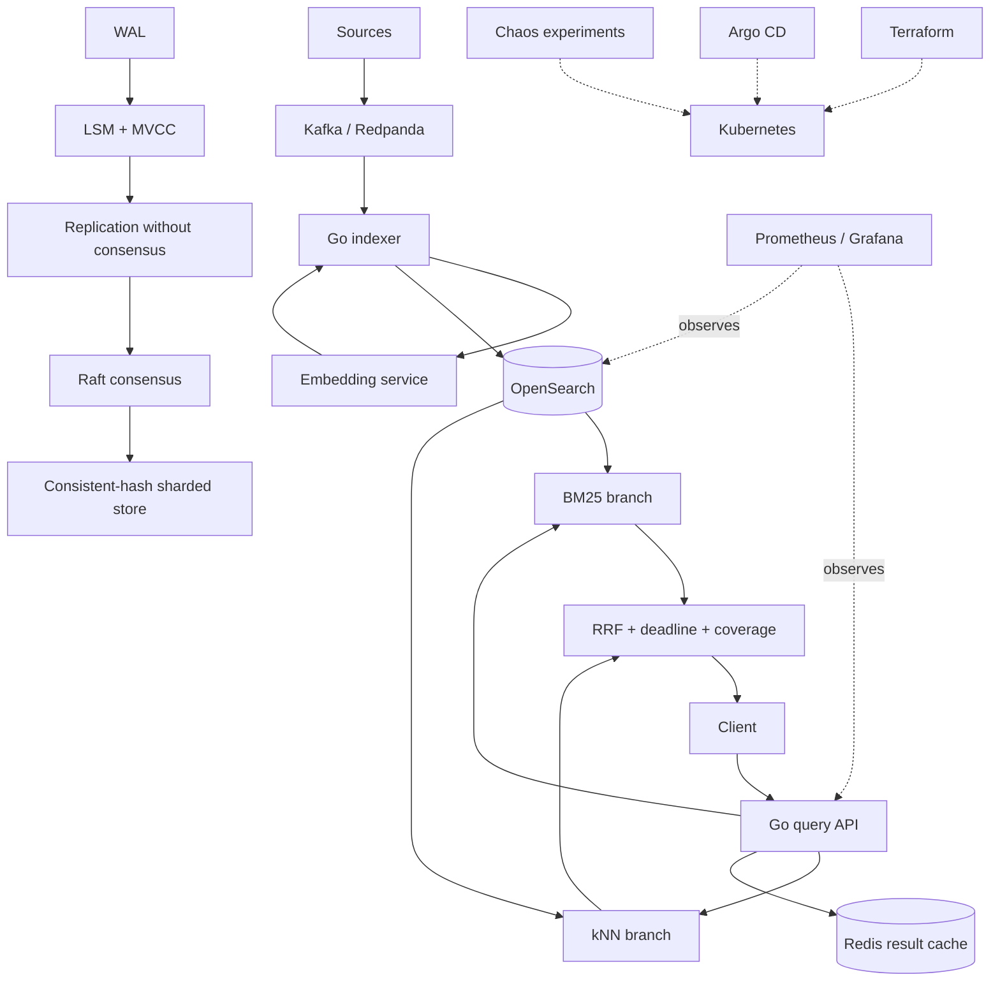

# LATTICE architecture

This is the architecture represented by the authoritative roadmap in [`lattice.md`](lattice.md). The system has a teaching track and a production search track; they meet at the API and operational evidence, but the final search index is OpenSearch rather than the from-scratch LSM engine.

## Runtime boundaries

- `cmd/main.go` is the query/control service. Without `OPENSEARCH_URL` it runs the durable local backend; with it, it uses the OpenSearch adapter and optionally publishes documents to Kafka. `OPENSEARCH_USERNAME`, `OPENSEARCH_PASSWORD`, and `OPENSEARCH_CA_FILE` enable authenticated TLS connections to an operator-managed cluster.
- `cmd/indexer` consumes Kafka records, validates them, writes OpenSearch, and commits offsets only after indexing or dead-lettering.
- `pkg/wal`, `pkg/lsm`, `pkg/raft`, `pkg/replication`, and `pkg/shard` are readable from-scratch implementations used to prove the underlying distributed-systems concepts.
- `internal/search` provides the deterministic local hybrid-search backend used by the playground, unit tests, and failure drills. Repeated `tag` parameters are applied as an AND filter in local mode and in the OpenSearch adapter.
- `internal/providers` contains the real Kafka and OpenSearch boundaries.
- `deploy/` contains Compose for local service integration and Kubernetes/Terraform/Argo CD deployment shapes. Terraform owns the OpenSearch cluster/node pool; Argo CD owns the application, index template, ISM, observability, and scheduled-job resources so the two reconcilers do not overwrite one another. A fresh kind run has verified the Terraform/operator and application path through publish, Kafka/indexer consumption, and hybrid search; Argo reconciliation and multi-node chaos remain separate production checks.
- `deploy/k8s-secure` is an explicit certificate-backed overlay: it enables TLS on the API and mTLS from query/indexer to OpenSearch. The base Kubernetes manifests stay convenient for development and do not pretend that generated certificate secrets exist.

## Failure contract

Every query runs under one deadline. A branch or shard that does not answer before expiry is excluded from the result set, and the response reports `coverage.complete: false`. Metrics count incomplete responses. This is the central LATTICE behavior: degraded answers are useful only when the degradation is visible.

Search pages return an opaque `next_cursor` bound to the query, filters, and
page size. Clients pass it back as `search_after`; arbitrary deep `from` values
are rejected at the API boundary.

## Data and recovery contract

Local acknowledged writes reach the WAL before they are exposed through the local index. The Kafka path is at-least-once; deterministic document IDs make replay idempotent. Local snapshots use an fsynced temporary file followed by an atomic rename. With `OPENSEARCH_ALIAS` configured, the remote adapter creates generation indices, reindexes through `_reindex`, atomically swaps the alias, and delegates snapshots/restores to the native repository APIs. The Compose path has verified a 1,000,008-document native restore into a fresh target in 25.016s; a production scratch-cluster/object-store drill remains required before claiming a production SLO.

See [`walkthrough.md`](walkthrough.md) to exercise the architecture and [`RUNBOOK.md`](RUNBOOK.md) for operational response.
