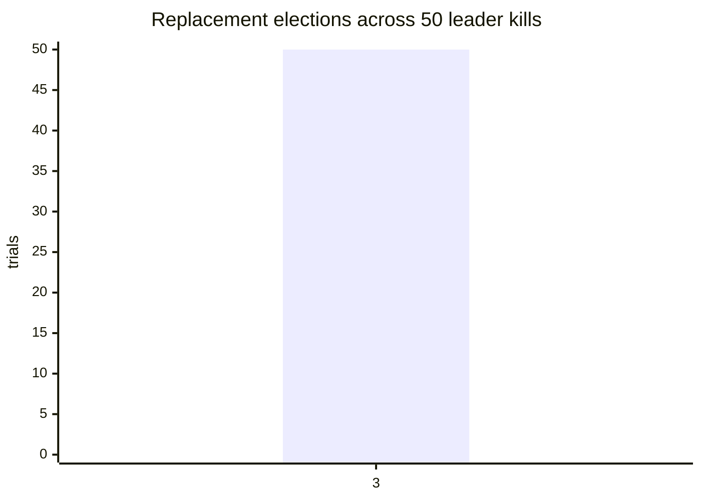

# LATTICE Benchmarks

This report is intentionally a measurement log. Empty cells are not estimates.

## Required measurements

| Measurement | Target | Result | Environment | Date |
|---|---:|---:|---|---|
| Corpus size | ≥ 1,000,000 docs | 1,000,008 searchable documents | Compose: Redpanda → Go indexer → OpenSearch | 2026-08-31 |
| Query p50 | < 50ms target | 16.66ms at rest; 24.69ms during concurrent indexing | Compose, 10,000 queries, concurrency 32 | 2026-08-31 |
| Query p99 | < 200ms target | 191.85ms at rest; 0 HTTP failures; 93 incomplete responses | Compose, 1,000,008-document corpus, 200ms deadline | 2026-08-31 |
| Query p99 during segment merge | < 400ms target | 49.06ms; 0 HTTP failures; 24 incomplete responses | Compose, explicit OpenSearch force-merge of 1,000,008-document index; 59 → 3 primary segments | 2026-08-31 |
| Sustained query throughput | — | 1,514 QPS at rest; 939 QPS during concurrent indexing | Compose, 10,000 queries, concurrency 32 | 2026-08-31 |
| Sustained indexing throughput | — | 1,000,000 API publishes in 450.53s (2,220 publishes/s) | Compose, `latticectl`, concurrency 64; asynchronous Kafka drain | 2026-08-31 |
| Single-node recovery | < 5 minutes target | — | — | — |
| Snapshot restore time | — | 25.016s for 1,000,008 documents; restored count verified | Compose OpenSearch filesystem repository, fresh target index | 2026-08-31 |
| Cost per million documents | — | — | — | — |
| Cost per million queries | — | — | — | — |
| WAL subprocess SIGKILL recovery | 100 runs | 100/100 acknowledged-write recoveries passed | Go child-process harness, local filesystem | 2026-08-31 |
| Raft repeated test suite | 100 runs | 100/100 passed | Go logical cluster, local test runner | 2026-08-31 |
| Local hybrid search benchmark, 10k docs | — | 89.96ms/op | AMD Ryzen 7 PRO 5850U, Go benchmark, 16 workers | 2026-08-30 |
| Local hybrid search benchmark, 1M docs | — | 1.485s/op (one sample) | AMD Ryzen 7 PRO 5850U, deterministic in-process backend, Go benchmark | 2026-08-31 |
| Compose acceptance flow | — | Passed | Redpanda v24.3.8, OpenSearch 2.17.1, Redis 7.4; publish/search, indexer restart replay, alias reindex | 2026-08-31 |
| Compose native snapshot/restore | — | 712ms | OpenSearch filesystem repository, 8-document test corpus, API restore into a fresh target; one acceptance run | 2026-08-31 |
| Compose full-corpus remote benchmark | < 200ms p99 target | 16.66ms p50, 191.85ms p99, 1,514 QPS, 0 HTTP failures, 93 incomplete responses | OpenSearch 2.17.1, Redpanda v24.3.8, Redis 7.4; 1,000,008 docs; concurrency 32 | 2026-08-31 |
| Compose merge-window remote benchmark | < 400ms p99 target | 24.69ms p50, 95.55ms p99, 939 QPS, 0 HTTP failures, 64 incomplete responses | Same stack; 100,000 concurrent API publishes during 10,000 queries | 2026-08-31 |
| Compose explicit force-merge benchmark | < 400ms p99 target | 18.00ms p50, 49.06ms p99, 1,547 QPS, 0 HTTP failures, 24 incomplete responses; merge completed in 360.390s | Same stack; asynchronous OpenSearch `_forcemerge(max_num_segments=1)`; 59 → 3 primary segments; document count unchanged | 2026-08-31 |
| Kubernetes operator/application smoke | — | Passed: fresh operator OpenSearch `1/1`, Redpanda, Redis, indexer, and query all `1/1`; API publish → Kafka/indexer → hybrid search returned `coverage.complete:true` | Fresh kind cluster; Terraform; cert-manager 1.16.3; OpenSearch Operator 2.8.4 / `opensearch.org/v1`; OpenSearch 2.17.1; Redpanda v24.3.8 | 2026-08-31 |

## Election distribution

`make election-evidence` runs 50 logical leader-kill trials and writes the
per-trial observations to [`election-distribution.csv`](election-distribution.csv).
The measurement is in Raft election ticks, which is deterministic for the
message-driven teaching cluster; production wall-clock election latency still
needs a real-cluster measurement.

The current 50-trial result is:

| Logical election ticks | Trials |
|---:|---:|
| 3 | 50 |



## Method

Each run records the commit, corpus source, document size distribution, embedding model and dimensions, shard/replica count, node sizes, storage type, query mix, concurrency, warm-up period, and measurement duration.

The recorded local baselines above are development signals only: they use the deterministic in-process backend, and the 1M result is one benchmark sample rather than a percentile. Neither is evidence for the OpenSearch one-million-document SLOs.

The benchmark corpus is configurable without editing code. The reproducible local stress command is:

```bash
LATTICE_BENCH_DOCS=1000000 make bench-query
```

For the production claim, run the equivalent workload against the Compose/Kubernetes OpenSearch path and record the hardware, embedding model, merge state, percentiles, and failure behavior below; a local in-process result must not be substituted for it.

The production-shaped percentile runner is `make bench-remote`; it requires a
running API and an already-loaded declared corpus. It writes a JSON report with
latency percentiles, throughput, HTTP failures, incomplete coverage, and API
errors. Run it both at rest and during active indexing/segment merges.

The raw Compose reports are [`remote-benchmark-1000008.json`](remote-benchmark-1000008.json),
[`remote-benchmark-merge-1000008.json`](remote-benchmark-merge-1000008.json), and
[`remote-benchmark-forcemerge-1000008.json`](remote-benchmark-forcemerge-1000008.json).
The at-rest run met the 200ms p99 target but returned 93 explicitly incomplete
responses under the 200ms deadline; those are coverage signals, not hidden
successes.

Latency is reported as histograms and percentiles. Averages are not used to make SLO claims. Merge-window measurements run indexing and querying concurrently while segment-merge duration is recorded beside query p99.

## Cost model

```text
cost_per_million_docs =
  (node_hours × hourly_rate + storage_gb_months × rate)
  / docs_indexed × 1e6

cost_per_million_queries =
  (node_hours × hourly_rate)
  / queries_served × 1e6
```

Idle provisioned capacity is included. Managed-service comparison prices include their measurement date.
