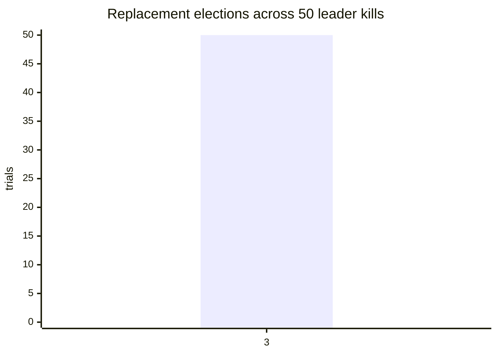

# LATTICE Benchmarks

This report is intentionally a measurement log. Empty cells are not estimates.

## How to read every number here

Three rules apply to every row. They exist because the first version of this
report broke all three.

1. **Backend and fault source are mandatory columns.** The in-process index and
   OpenSearch are different systems; their numbers are not interchangeable. A
   fault injected in-process through `/v1/debug/shards` is not an observed node
   failure. Both are recorded in every artifact under `environment.backend` and
   `environment.fault_source`.
2. **No headline number comes from a single run.** Repeated configurations are
   reported as a median with an interquartile range. A row marked *one sample*
   has no dispersion behind it and is a development signal, not evidence.
3. **Coverage and errors are separate columns.** `incomplete_responses` counts
   lost shard coverage; `degraded_responses` counts responses carrying an
   error. They are different events. See the correction below.

## Correction: the four original remote runs measured deadline expiry, not shard loss

The four `remote-benchmark-*.json` files each report identical counts of
incomplete and error responses — 56/56, 93/93, 64/64, 24/24. That is not a
property of the system. Completeness was computed as

```go
coverage.Complete = shardsAnswered == shardsQueried && len(response.Errors) == 0
```

so "incomplete" was *defined* to include "an error occurred". The two counters
could not diverge. Every incomplete response in those runs was a deadline
expiry, and **the shard-unavailable path was never exercised in any of them.**

Those files are kept as historical record. Their latency percentiles remain
valid; their coverage columns must be read as "deadline expiries", not as
"partial results from an unreachable shard". The measurement that supports the
partial-results claim is in [`experiments/`](experiments/README.md).

## Required measurements

Every row states the backend that produced it and where any fault came from.
`n` is the number of runs behind the number; `n=1` means one sample and no
dispersion, which is a development signal rather than evidence.

| Measurement | Target | Result | Backend | Fault source | n | Environment | Date |
|---|---:|---:|---|---|---:|---|---|
| Corpus size | ≥ 1,000,000 docs | 1,000,008 searchable documents | opensearch | none | 1 | Compose: Redpanda → Go indexer → OpenSearch | 2026-08-31 |
| Query p50 | < 50ms target | 16.66ms at rest; 24.69ms during concurrent indexing | opensearch | none | 1 | Compose, 10,000 queries, concurrency 32, query `distributed consensus` | 2026-08-31 |
| Query p99 | < 200ms target | 191.85ms at rest; 0 HTTP failures; 93 incomplete responses, **all of them deadline expiries** | opensearch | none | 1 | Compose, 1,000,008-document corpus, 200ms deadline | 2026-08-31 |
| Query p99 during segment merge | < 400ms target | 49.06ms; 0 HTTP failures; 24 incomplete responses, **all deadline expiries** | opensearch | none | 1 | Compose, explicit OpenSearch force-merge of 1,000,008-document index; 59 → 3 primary segments | 2026-08-31 |
| Sustained query throughput | — | 1,514 QPS at rest; 939 QPS during concurrent indexing | opensearch | none | 1 | Compose, 10,000 queries, concurrency 32 | 2026-08-31 |
| Sustained indexing throughput | — | 1,000,000 API publishes in 450.53s (2,220 publishes/s) | opensearch | none | 1 | Compose, `latticectl`, concurrency 64; asynchronous Kafka drain | 2026-08-31 |
| Partial results, availability path | incomplete > 0 with 0 errors | 5,000/5,000 responses incomplete, 0 errors, 0 degraded, all `reason: shard_unavailable`; 5 of 9 configurations pure | in-memory | injected-in-process | 5 | 3 shards, 5,000 docs, 200ms deadline, concurrency 4/8/16, 3 query classes ([`experiments/`](experiments/README.md)) | 2026-09-12 |
| Coverage/error invariant under compound load | errors == deadline expiries | Held exactly in all 4 compound configurations: 1203=1203, 16=16, 1370=1370, 768=768 | in-memory | injected-in-process | 5 | Same run; configurations where the fault also expired the deadline | 2026-09-12 |
| Partial results on a real cluster | incomplete > 0 with 0 errors | Data node stopped, cluster red, `_shards` 2 of 3: 5,000/5,000 responses incomplete, 0 errors, 0 degraded, all `shard_unavailable`; cluster recovered to green and returned to baseline. 1 of 9 configurations pure, 3 compound holding `errors == deadline` exactly, 5 excluded as saturated | opensearch | induced-in-cluster | 5 | OpenSearch 2.17.1, 3 data nodes @ 256mb heap, 3 shards, 0 replicas, 20,000 docs, 17 segments, 200ms deadline, concurrency 4/8/16 | 2026-09-12 |
| Degraded-mode cost, in-process vs OpenSearch | — | Losing a shard is 43x *slower* in-process (2.00 -> 86.56ms) and 1.9x *faster* on OpenSearch (195.35 -> 102.79ms) — the sign of the effect flips between backends | both | injected-in-process / induced-in-cluster | 5 | p99 median, `common` class at c=4, same two runs | 2026-09-12 |
| Failure-class latency signature | — | Availability loss scales with load (56/128/227ms at c=4/8/16); deadline expiry is flat at the budget (207/207/219ms, IQR < 1ms) | in-memory | injected-in-process | 5 | `rare` query class, p99 median, same run | 2026-09-12 |
| Single-node recovery | < 5 minutes target | — | — | — | — | — | — |
| Snapshot restore time | — | 25.016s for 1,000,008 documents; restored count verified | opensearch | none | 1 | Compose OpenSearch filesystem repository, fresh target index | 2026-08-31 |
| Cost per million documents | — | — | — | — | — | — | — |
| Cost per million queries | — | — | — | — | — | — | — |
| WAL subprocess SIGKILL recovery | 100 runs | 100/100 acknowledged-write recoveries passed | learning track (`pkg/wal`) | induced-in-process (`SIGKILL`) | 100 | Go child-process harness, local filesystem | 2026-08-31 |
| Raft repeated test suite | 100 runs | 100/100 passed | learning track (`pkg/raft`) | injected-in-process | 100 | Deterministic in-process cluster, not a networked one; local test runner | 2026-08-31 |
| Local hybrid search benchmark, 10k docs | — | 89.96ms/op | in-memory | none | 1 | AMD Ryzen 7 PRO 5850U, Go benchmark, 16 workers | 2026-08-30 |
| Local hybrid search benchmark, 1M docs | — | 1.485s/op | in-memory | none | 1 | AMD Ryzen 7 PRO 5850U, deterministic in-process backend, Go benchmark | 2026-08-31 |
| Compose acceptance flow | — | Passed | opensearch | none | 1 | Redpanda v24.3.8, OpenSearch 2.17.1, Redis 7.4; unique publish/search, indexer restart replay, alias reindex, native snapshot/restore, metrics | 2026-09-01 |
| Compose native snapshot/restore | — | 712ms | opensearch | none | 1 | OpenSearch filesystem repository, 8-document test corpus, API restore into a fresh target | 2026-08-31 |
| Compose full-corpus remote benchmark | < 200ms p99 target | 16.66ms p50, 191.85ms p99, 1,514 QPS, 0 HTTP failures, 93 deadline expiries | opensearch | none | 1 | OpenSearch 2.17.1, Redpanda v24.3.8, Redis 7.4; 1,000,008 docs; concurrency 32 | 2026-08-31 |
| Compose merge-window remote benchmark | < 400ms p99 target | 24.69ms p50, 95.55ms p99, 939 QPS, 0 HTTP failures, 64 deadline expiries | opensearch | none | 1 | Same stack; 100,000 concurrent API publishes during 10,000 queries | 2026-08-31 |
| Compose explicit force-merge benchmark | < 400ms p99 target | 18.00ms p50, 49.06ms p99, 1,547 QPS, 0 HTTP failures, 24 deadline expiries; merge cost 360.390s | opensearch | none | 1 | Same stack; asynchronous OpenSearch `_forcemerge(max_num_segments=1)`; 59 → 3 primary segments; document count unchanged | 2026-08-31 |
| Kubernetes operator/application smoke | — | Passed: fresh operator OpenSearch `1/1`, Redpanda, Redis, indexer, and query all `1/1`; API publish → Kafka/indexer → hybrid search returned `coverage.complete:true` | opensearch | none | 1 | Fresh kind cluster; Terraform; cert-manager 1.16.3; OpenSearch Operator 2.8.4 / `opensearch.org/v1`; OpenSearch 2.17.1; Redpanda v24.3.8 | 2026-08-31 |
| Latest Compose restore assertion | — | Passed: 18.342s restore operation; replay document remained searchable with `coverage.complete:true` after restore | opensearch | none | 1 | Existing Compose corpus; OpenSearch filesystem repository; fresh restore target; corrected `make smoke-compose` | 2026-09-01 |

## Election distribution

`make election-evidence` runs 50 logical leader-kill trials and writes the
per-trial observations to [`election-distribution.csv`](election-distribution.csv).
The measurement is in Raft election ticks, which is deterministic for the
message-driven teaching cluster; production wall-clock election latency still
needs a real-cluster measurement.

The current 50-trial result is:

| Logical election ticks | Trials |
|---:|---:|
| 3 | 50 |



## Method

Each run records the commit, backend, fault source, corpus source, document
size distribution, embedding model and dimensions, shard/replica count, node
count and heap, segment count at measurement time, OpenSearch version, query
class, concurrency, warm-up period, and measurement duration. `latticebench`
collects these into `environment` automatically and lists anything it could not
reach under `environment.unavailable`, so a reader can tell a zero from a value
that was never gathered.

The measurement design, which the original runs did not have:

| Dimension | What is swept |
|---|---|
| Repeats | 5 runs minimum per configuration; median and IQR reported |
| Query class | A common term, a rare term, and a multi-term phrase — tail behaviour differs sharply between them in a hybrid index |
| Offered load | Concurrency 8, 32, 128, so latency is a function of load rather than one point |
| Warm-up | A fixed, stated warm-up period per configuration, discarded |
| Branch attribution | BM25 and kNN timings recorded separately, so a tail can be attributed to a branch |

The recorded local baselines above are development signals only: they use the deterministic in-process backend, and the 1M result is one benchmark sample rather than a percentile. Neither is evidence for the OpenSearch one-million-document SLOs.

The benchmark corpus is configurable without editing code. The reproducible local stress command is:

```bash
LATTICE_BENCH_DOCS=1000000 make bench-query
```

For the production claim, run the equivalent workload against the Compose/Kubernetes OpenSearch path and record the hardware, embedding model, merge state, percentiles, and failure behavior below; a local in-process result must not be substituted for it.

The production-shaped percentile runner is `make bench-remote`; it requires a
running API and an already-loaded declared corpus. It sweeps query classes and
concurrency levels, repeats each configuration, and writes a JSON report with
per-run detail and an aggregate median/IQR for every headline field. Run it both
at rest and during active indexing/segment merges.

The designed experiments are separate from the capacity runs, because each one
has a pass condition rather than just an output:

| Command | Question it answers |
|---|---|
| `make experiment-partial-opensearch` | Does a genuinely stopped data node produce partial results with no errors? |
| `make experiment-partial-local` | Same question in-process, as a controlled comparison, plus the deadline class for contrast |
| `make experiment-segments` | How does tail latency move with segment count, which branch owns the sensitivity, and what did the merge cost? |

See [`experiments/README.md`](experiments/README.md).

The raw Compose reports are [`remote-benchmark-1000008.json`](remote-benchmark-1000008.json),
[`remote-benchmark-merge-1000008.json`](remote-benchmark-merge-1000008.json), and
[`remote-benchmark-forcemerge-1000008.json`](remote-benchmark-forcemerge-1000008.json).
The at-rest run met the 200ms p99 target but returned 93 explicitly incomplete
responses under the 200ms deadline. Those are coverage signals rather than
hidden successes — but read them as **deadline expiries specifically**, not as
partial results from an unreachable shard. See the correction above.

Latency is reported as histograms and percentiles. Averages are not used to make SLO claims. Merge-window measurements run indexing and querying concurrently while segment-merge duration is recorded beside query p99.

## Finding: segment count dominates tail latency

This is the strongest result in the repository and it was not designed. Across
the 1,000,008-document corpus, as the index was compacted:

| Index state | Primary segments | p50 | p99 | Backend | n |
|---|---:|---:|---:|---|---:|
| At rest | 59 | 16.66ms | 191.85ms | opensearch | 1 |
| During concurrent indexing | (merging) | 24.69ms | 95.55ms | opensearch | 1 |
| After explicit force-merge | 3 | 18.00ms | 49.06ms | opensearch | 1 |

**p99 fell roughly 4×. p50 moved by a couple of milliseconds and not
monotonically.** Segment count is dominating tail latency and almost nothing
else. The mechanism is straightforward: a search visits every segment, so more
segments means more opportunities for one of them to be slow, and the worst
segment sets the tail.

Two things must be said alongside it, or the finding is oversold:

**The merge cost 360.390 seconds** of heavy disk and CPU work, and force-merge
is one-way and not something to run continuously against a live index. "p99 can
be cut 4×" is marketing. "p99 can be cut 4× for six minutes of merging you
cannot repeat cheaply" is a result.

**These are three incidental points with n=1 each, not a curve.** They came from
runs taken for other reasons. `make experiment-segments` turns this into a
designed experiment: controlled segment counts read back from the `_segments`
API, repeats with an IQR, the BM25 and kNN branch timings recorded separately so
the sensitivity can be attributed to one branch, and the merge cost captured per
point. Until that has run with at least four distinct segment counts, the table
above is an observation worth investigating rather than a measured relationship.

## Cost model

```text
cost_per_million_docs =
  (node_hours × hourly_rate + storage_gb_months × rate)
  / docs_indexed × 1e6

cost_per_million_queries =
  (node_hours × hourly_rate)
  / queries_served × 1e6
```

Idle provisioned capacity is included. Managed-service comparison prices include their measurement date.
